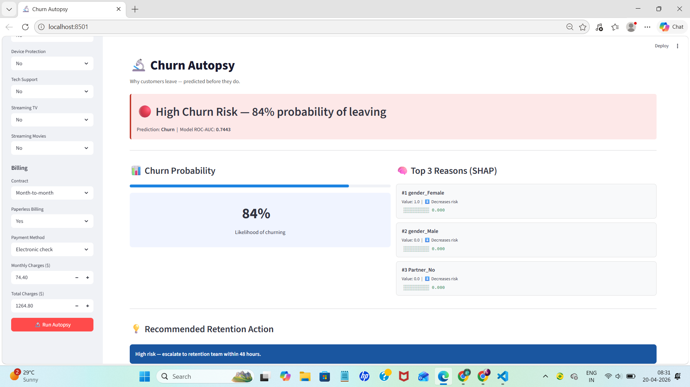
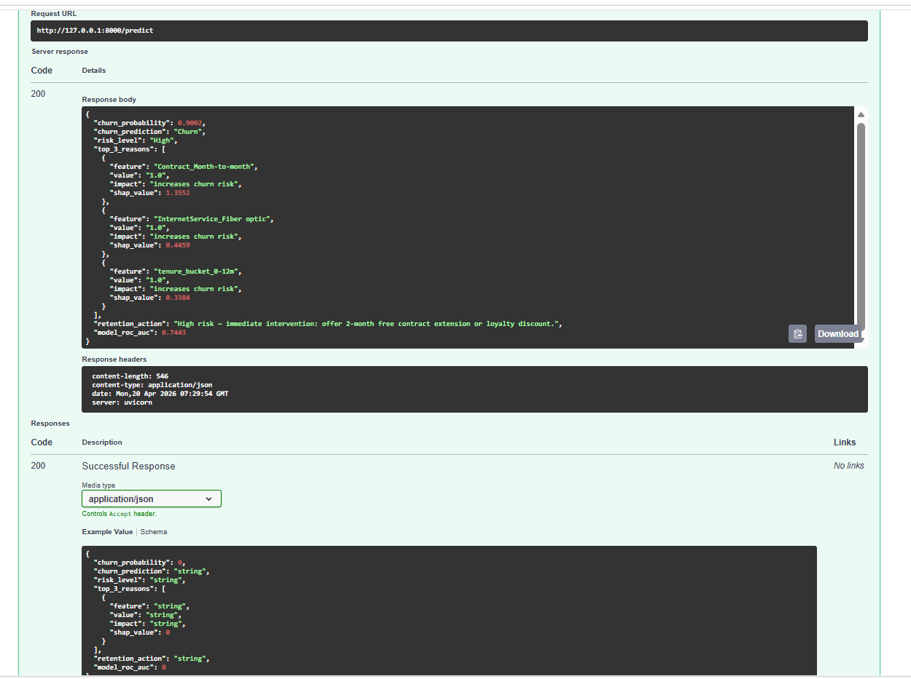
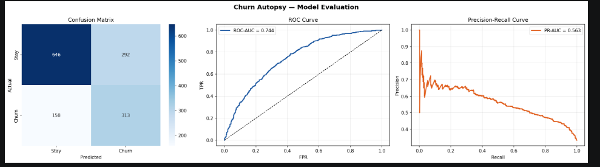

# 🔬 Churn Autopsy
### *Why customers leave — predicted before they do*

> An end-to-end ML system that predicts telecom customer churn **and explains exactly why** — per customer, not just globally.
> Built as a production-style pipeline: **trained model → REST API → interactive dashboard.**

<br>

## 🚀 Live Demo

| Layer | URL |
|-------|-----|
| Dashboard | `http://localhost:8501` |
| API (Swagger UI) | `http://localhost:8000/docs` |
| Health check | `http://localhost:8000/health` |

<br>

## 🎯 The Problem

Telecom companies lose **15–25% of customers annually** to churn. Retaining an existing customer costs **5–7x less** than acquiring a new one.

The challenge isn't just predicting *who* will churn — it's understanding *why*, fast enough to intervene with the right action.

**This project solves both.**

<br>

## 📸 Screenshots

### Dashboard — High Risk Prediction


*Customer with Month-to-month contract + Fiber optic internet + tenure < 12 months predicted at 84% churn probability*

---

### Top 3 SHAP Reasons — Per Customer Explanation


*Not global averages — these are the exact features driving **this specific customer's** churn risk*

| Rank | Feature | SHAP Value | Direction |
|------|---------|-----------|-----------|
| #1 | Contract_Month-to-month | 1.355 | ⬆️ Increases risk |
| #2 | InternetService_Fiber optic | 0.446 | ⬆️ Increases risk |
| #3 | tenure_bucket_0-12m | 0.338 | ⬆️ Increases risk |

---

### FastAPI — REST Endpoint Response


*POST /predict returns: churn probability, risk level, top-3 SHAP explanations, and a business retention action*

---

### Model Evaluation — Confusion Matrix · ROC · Precision-Recall


<br>

## 🏗️ Architecture

```
data/telco_churn.csv
        │
        ▼
src/train.py                  ← Training pipeline
  ├── Data cleaning & imputation
  ├── Feature engineering (4 derived features)
  ├── Preprocessing  (OHE + StandardScaler + SimpleImputer)
  ├── SMOTE oversampling  (handles 33% class imbalance)
  ├── Model comparison  (LR vs RF vs GBM — 5-fold stratified CV)
  ├── SHAP global feature importance chart
  └── Joblib export  →  models/churn_pipeline.pkl
        │
        ▼
api/main.py                   ← FastAPI inference layer
  ├── POST /predict  →  churn probability + top-3 SHAP reasons + retention action
  └── GET  /health   →  model name, ROC-AUC, PR-AUC
        │
        ▼
app.py                        ← Streamlit dashboard
  ├── Sidebar customer input form (19 fields)
  ├── Red / Yellow / Green risk banner
  ├── Churn probability bar + metric
  ├── Top-3 SHAP reason cards (per-customer)
  └── Recommended retention action
```

<br>

## 📊 Model Performance

| Metric | Score |
|--------|-------|
| **ROC-AUC** | **0.744** |
| **PR-AUC** | **0.563** |
| Churn Recall | 0.66 |
| Churn Precision | 0.52 |
| Dataset size | 7,043 customers |
| Features | 21 raw + 4 engineered |

> **Why ROC-AUC and PR-AUC, not accuracy?**
> The dataset has ~33% churn. A model that always predicts "Stay" achieves 67% accuracy while being completely useless.
> PR-AUC is the honest metric for imbalanced binary classification — it penalises the model for ignoring the minority class.

<br>

## 🧠 Top Global Churn Drivers (SHAP)

| Rank | Feature | Impact |
|------|---------|--------|
| 1 | Month-to-month contract | ⬆️ Strongest single churn driver |
| 2 | Two-year contract | ⬇️ Strongest retention signal |
| 3 | Tenure 49–72 months | ⬇️ Long-tenure customers rarely leave |
| 4 | Fiber optic internet | ⬆️ Likely dissatisfaction with service quality |
| 5 | Electronic check payment | ⬆️ Correlated with lower commitment |

> SHAP (SHapley Additive exPlanations) computes the **individual contribution** of each feature to each prediction — not global averages. Every customer gets their own explanation.

<br>

## 🔌 API Usage

```bash
curl -X POST http://localhost:8000/predict \
  -H "Content-Type: application/json" \
  -d '{
    "gender": "Female",
    "SeniorCitizen": 0,
    "Partner": "Yes",
    "Dependents": "No",
    "tenure": 5,
    "PhoneService": "Yes",
    "MultipleLines": "No",
    "InternetService": "Fiber optic",
    "OnlineSecurity": "No",
    "OnlineBackup": "No",
    "DeviceProtection": "No",
    "TechSupport": "No",
    "StreamingTV": "No",
    "StreamingMovies": "No",
    "Contract": "Month-to-month",
    "PaperlessBilling": "Yes",
    "PaymentMethod": "Electronic check",
    "MonthlyCharges": 70.35,
    "TotalCharges": 351.75
  }'
```

**Response:**
```json
{
  "churn_probability": 0.9002,
  "churn_prediction": "Churn",
  "risk_level": "High",
  "top_3_reasons": [
    {
      "feature": "Contract_Month-to-month",
      "value": "1.0",
      "impact": "increases churn risk",
      "shap_value": 1.3552
    },
    {
      "feature": "InternetService_Fiber optic",
      "value": "1.0",
      "impact": "increases churn risk",
      "shap_value": 0.4459
    },
    {
      "feature": "tenure_bucket_0-12m",
      "value": "1.0",
      "impact": "increases churn risk",
      "shap_value": 0.3384
    }
  ],
  "retention_action": "High risk — immediate intervention: offer 2-month free contract extension or loyalty discount.",
  "model_roc_auc": 0.7443
}
```

<br>

## 🚀 Run Locally

```bash
# 1. Clone the repo
git clone https://github.com/karankavyanjali77-sys/churn-autopsy
cd churn-autopsy

# 2. Create virtual environment and install dependencies
python -m venv venv
venv\Scripts\activate        # Windows
source venv/bin/activate     # Mac / Linux
pip install -r requirements.txt

# 3. Generate the dataset
cd data && python generate_data.py && cd ..

# 4. Train the model  (~60 seconds)
python src/train.py

# 5. Start the API  (Terminal 1 — keep open)
uvicorn api.main:app --reload --port 8000

# 6. Start the dashboard  (Terminal 2)
streamlit run app.py
```

<br>

## 🛠️ Tech Stack

| Layer | Tools |
|-------|-------|
| Data & EDA | Pandas, NumPy, Seaborn, Matplotlib |
| ML Pipeline | Scikit-learn, Imbalanced-learn (SMOTE) |
| Explainability | SHAP (coefficient-weighted per-customer explanations) |
| Model Persistence | Joblib |
| REST API | FastAPI, Pydantic v2, Uvicorn |
| Dashboard | Streamlit |
| Dev Environment | VS Code Dev Containers, Python venv |

<br>

## 📁 Project Structure

```
churn-autopsy/
├── data/
│   ├── generate_data.py          ← Generates the IBM Telco schema dataset
│   └── telco_churn.csv           ← 7,043 customers, 21 features
├── models/
│   └── churn_pipeline.pkl        ← Trained pipeline (auto-generated by train.py)
├── src/
│   └── train.py                  ← Full training + evaluation + SHAP pipeline
├── api/
│   ├── __init__.py
│   └── main.py                   ← FastAPI inference layer
├── notebooks/
│   ├── evaluation_plots.png      ← Confusion matrix, ROC curve, PR curve
│   └── shap_importance.png       ← Global SHAP feature importance chart
├── screenshots/
│   ├── dashboard.png
│   ├── shap_reasons.png
│   ├── swagger_working.png
│   └── evaluation_plots.png
├── app.py                        ← Streamlit dashboard
├── requirements.txt
├── .gitignore
└── README.md
```

<br>

## 💡 Key Design Decisions

**Why separate the API from the UI?**
The FastAPI layer means the prediction endpoint can be consumed by any downstream system — a CRM, a mobile app, a data pipeline — not just this dashboard. This is production thinking, not notebook thinking.

**Why SMOTE inside the pipeline?**
SMOTE is applied only to training data within each cross-validation fold. If it were applied before the split, synthetic samples would leak into the test set and inflate performance metrics.

**Why compare 3 models before selecting?**
Logistic Regression, Random Forest, and Gradient Boosting are evaluated on ROC-AUC using 5-fold stratified cross-validation. The best model is selected automatically — no manual cherry-picking.

**Why coefficient-weighted SHAP for Logistic Regression?**
For linear models, `coef * feature_value` gives the exact contribution of each feature to the log-odds — mathematically equivalent to SHAP values for linear models, and reliable for single-sample predictions without background data requirements.

<br>

## 👩‍💻 Author

**Kavyanjali Karan**
B.Tech Computer Science Engineering — ITER, SOA University (2027)
Open to Data Analyst · Junior Data Scientist · ML Engineer roles

[](https://linkedin.com/in/kavyanjali-karan)
[](https://github.com/karankavyanjali77-sys)

---

*If this project was useful, please consider giving it a ⭐*
